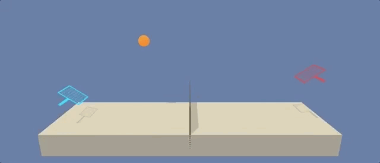
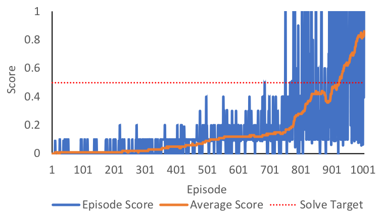

# Multi-Agent-DDPG-using-PTtorch-and-ML-Agents
A simple example of how to implement vector based DDPG for MARL tasks using PyTorch and a ML-Agents environment.

The repository includes the following files:
- ddpg_agent.py -> ddpg-agent implementation
- replay_buffer.py -> ddpg-agent's replay buffer implementation
- model.py -> example PyTorch Actor and Critic neural networks
- train.py -> initializes and implements the training processes for a DDPG-agent.
- test.py -> tests a trained DDPG-agent

The repository also includes links to the Mac/Linux/Windows versions of a simple Unity environment, *Tennis*, for testing.
This Unity application and testing environment was developed using ML-Agents Beta v0.4. The version of the Tennis environment employed for this project was developed for the Udacity Deep Reinforcement Nanodegree course. For more information about this course visit: https://www.udacity.com/course/deep-reinforcement-learning-nanodegree--nd893

The files in the python/. directory are the ML-Agents toolkit files and dependencies required to run the Tennis environment.
For more information about the Unity ML-Agents Toolkit visit: https://github.com/Unity-Technologies/ml-agents

## Example Unity Environment - Tennis
In this environment, two agents control rackets to bounce a ball over a net. If an agent hits the ball over the net, it receives a reward of +0.1. If an agent lets a ball hit the ground or hits the ball out of bounds, it receives a reward of -0.01. Thus, the goal of each agent is to keep the ball in play

### Multiagent Traning
The Tennis environment contains two unity agents. Each agent needs to collects observations from itself and its co-player. The task is essentially a cooperative task in that both agents maximize reward by hitting the ball back and forth for as long as possible.

### State and Action Space
The observation space consists of 8 variables corresponding to the position and velocity of the ball and racket. Each agent receives its own, local observation. Two continuous actions are available, corresponding to movement toward (or away from) the net, and jumping.

## Installation and Dependencies
1. Anaconda Python 3.6: Download and installation instructions here: https://www.anaconda.com/download/

2. Create (and activate) a new conda (virtual) environment with Python 3.6.
	- Linux or Mac:
	
		`conda create --name yourenvnamehere python=3.6`
	
		`source activate yourenvnamehere`

	- Windows:
	
		`conda create --name yourenvnamehere python=3.6`
	
		`activate yourenvnamehere`

3. Download and save this GitHub repository.

4. To install required dependencies (torch, ML-Agents trainers (v.4), etc...)
	- Naviagte to where you downloaded and saved this GitHub repository (e.g., *yourpath/thisgithubrepository*) 
	- Change to the '.python/' subdirectory and run from the command line:
	
		`pip3 install .`

	- Note: depdeing on your system setup, you may have to install PyTorch separatetly. 
		
## Download the Unity Environment
For this example project, you will not need to install Unity - this is because you can use a version of the Tennis's unity environment that is already built (compiled) as a standalone application. 

Download the relevant environment zip file from one of the links below. You need only to download the environment that matches your operating system:

- Linux: [click here](https://s3-us-west-1.amazonaws.com/udacity-drlnd/P3/Tennis/Tennis_Linux.zip)
- Mac OSX: [click here](https://s3-us-west-1.amazonaws.com/udacity-drlnd/P3/Tennis/Tennis.app.zip)
- Windows (32-bit): [click here](https://s3-us-west-1.amazonaws.com/udacity-drlnd/P3/Tennis/Tennis_Windows_x86.zip)
- Windows (64-bit): [click here](https://s3-us-west-1.amazonaws.com/udacity-drlnd/P3/Tennis/Tennis_Windows_x86_64.zip)

After you have downloaded the relevant zip file, navigate to where you downloaded and saved this GitHub repository and place the file in the main folder of the repository, then unzip (or decompress) the file.

NOTE: The Tennis environment is similar to, but not identical to the Tennis environment on the Unity ML-Agents GitHub page. 

## Training
 - activate the conda environment you created above
 - change the directory to the 'yourpath/thisgithubrepository' directory.
 - open `train.py`, find STEP 2 (lines 47 to 54) and set the relevant version of Tennis to match your operating system.
 - run the following command:
 
 	`python train.py`
	
 - training will complete once the agent reaches *solved_score* in `train.py`.
 - after training a *ddpgActor[1 & 2]_Model.path* and *ddpgCritic[1 or 2]_Model.path* files will be saved with the trained model weights
 - a *ddpgAgent_scores.csv* file will also be saved with the scores received during training. You can use this file to plot or assess training performance (see below figure).
 - It is recommended that you test different hyperparameter settings in `train.py` and `ddpg_agent.py`.

 

## Testing
 - activate the conda environment you created above
 - change the directory to the 'yourpath/thisgithubrepository' directory.
 - run the following command:
 
 	`python test.py`
	
 - An example model weights files are included in the repository (*ddpgActor1_Model.pth*, *ddpgActor2_Model.pth* and *ddpgCritic1_Model.pth*, *ddpgCritic2_Model.pth*).
 - A different model weights file can be tested by changing the model file name defined in `test.py`.
